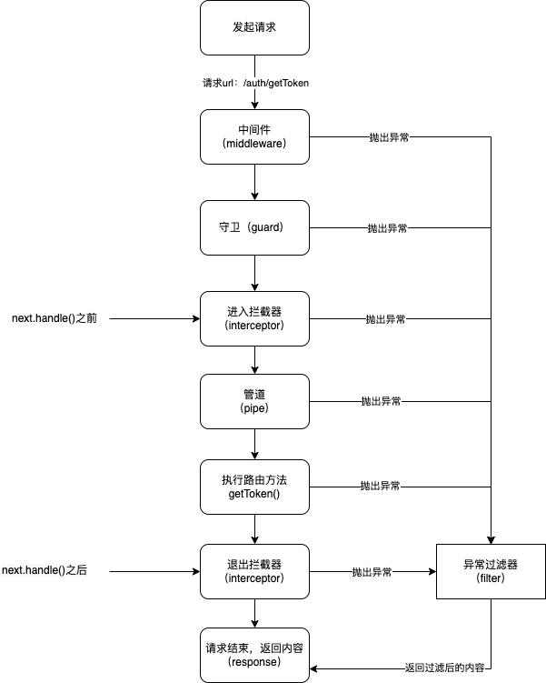

# 一个请求开始到结束过程中的nestjs程序执行流程图

说明：这里主要用于理解nestjs中的中间件、守卫、管道、异常过滤器、拦截器的关系。

**其中：** 异常过滤器是所有抛出的异常的统一处理方案

## 内置异常类

系统提供了不少内置的系统异常类，需要的时候直接使用throw new XXX(描述,状态)这样的方式即可抛出对应的异常,一旦抛出异常，当前请求将会终止。
注意每个异常抛出的状态码有所不同。如：
BadRequestException — 400
UnauthorizedException — 401
ForbiddenException — 403
NotFoundException — 404
NotAcceptableException — 406
RequestTimeoutException — 408
ConflictException — 409
GoneException — 410
PayloadTooLargeException — 413
UnsupportedMediaTypeException — 415
UnprocessableEntityException — 422
InternalServerErrorException — 500
NotImplementedException — 501
BadGatewayException — 502
ServiceUnavailableException — 503
GatewayTimeoutException — 504
